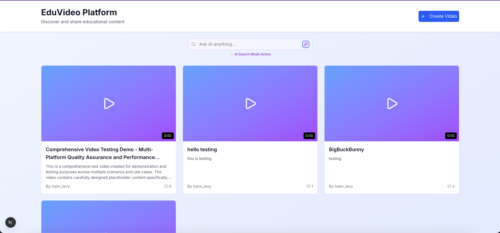
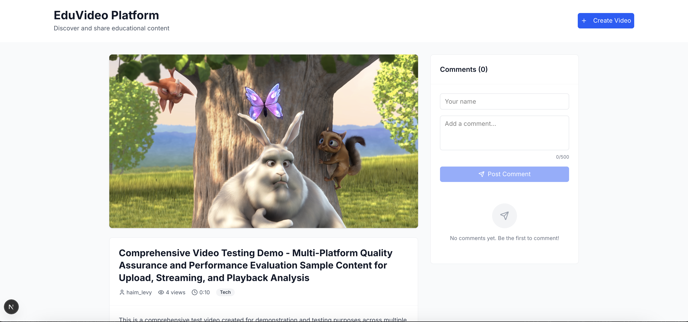
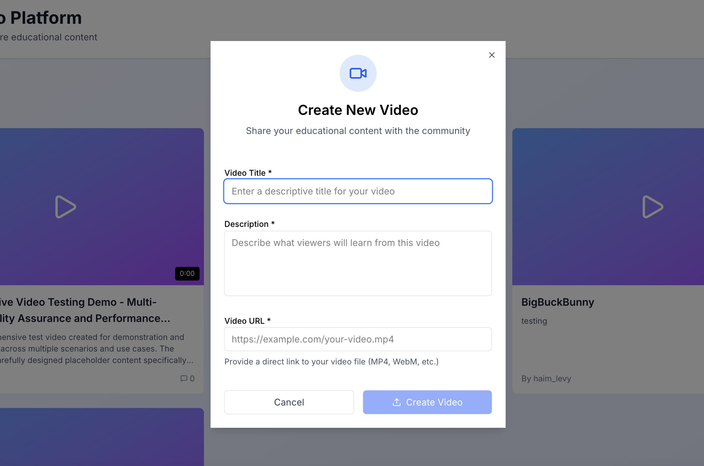

# Educational Video Player

## Overview
A web application built with React/Next.js that allows users to create, comment on, and watch educational videos. The platform features advanced search capabilities including semantic similarity search and provides a seamless learning experience with video playback controls and user interactions.
### Key Features
- Browse and select videos from a curated list
- **Advanced Search System:**
    - **RAG-based Similarity Search:** Semantic search based on content similarity in video descriptions and titles
    - **Traditional Text Search:** Regular keyword-based search functionality for precise title matching
- Create new video entries with title, description, and URL
- Interactive commenting system for each video
- Full-screen video player with playback controls
- Adjustable playback speed and volume controls

## Technology Stack
- **Frontend:** React/Next.js
- **Styling:** Tailwind CSS, Shadcn
- **API Integration:** Fetch API
- **Vector Database:** Qdrant
- **AI Services:**
- OpenAI Embeddings API (for semantic search)
- OpenAI API (for enhanced search responses)

## Getting Started

### Prerequisites
- Node.js (version 16 or higher)
- npm or yarn package manager

## Environment Variables

Create a `.env.local` file in the root directory with the following variables:

```bash
NEXT_PUBLIC_HOST=http://localhost:3000
NEXT_PUBLIC_DEFAULT_USER_ID=your_first_last_name

SCOPE_LABS_ENDPOINT=https://take-home-assessment-423502.uc.r.appspot.com/api

# Qdrant Vector Database Configuration
QDRANT_KEY=
QDRANT_URL=

# OpenAI API Configuration
OPENAI_KEY=
OPENAI_CHAT_MODEL=gpt-4o
OPENAI_MINI_MODEL=gpt-4o-mini
OPENAI_EMBED_MODEL=text-embedding-3-small

### Installation
```bash
# Clone the repository
git clone [your-repo-url]
cd educational-platform
# Install dependencies
npm install
# Start the development server
npm run dev
```

Open [http://localhost:3000](http://localhost:3000) in your browser

### Building for Production
```bash
npm run build
npm start
# or
yarn build
yarn start
```

## API Integration
The application integrates with the provided backend API using the user_id format: `[first_name]_[last_name]` (e.g., john_smith).

### API Endpoints Used
- GET /videos - Retrieve video list
- Query params: `freeText` (search query), `isRag` (boolean for similarity search mode)
- POST /videos - Create new video
- GET /videos/:id/comments - Get video comments
- POST /videos/:id/comments - Add new comment

## Screenshots

### Videos Page


### Video Details


### Create Video


## Project Structure
```
app/
├── api/
│   ├── comments/
│   └── videos/
├── videos/
│   └── [id]/
├── components/
│   ├── comments/
│   ├── ui/
│   └── video/
├── globals.css
├── layout.tsx
└── page.tsx
```

## Design Decisions
- **Component Architecture:** Modular components for reusability and maintainability
- **State Management:** No context provider needed - used URL parameters for search state to preserve user experience and maintain SSR compatibility
- **UI/UX:** Clean, educational-focused design with intuitive navigation
- **Responsive Design:** Mobile-first approach for accessibility across devices

## Features Implemented
- ✅ Video list display and selection
- ✅ Similarity search based on title and description
- ✅ Video creation functionality
- ✅ Comment system with real-time updates
- ✅ Full-screen video playback
- ✅ Playback speed and volume controls
- ✅ Responsive design
- ✅ Error handling and loading states(partial)

## Future Enhancements
- Video search and advanced filtering
- User authentication and profiles
- Video categories and tags
- Like/dislike functionality
- Video recommendations on the video details page based on similarity search and category.
- Auto generate title and description to a video based on the video transcript(transcript api)
- Better error handling
- List pagination based on cursor.
- **Architecture Optimization:** Refactor server actions to execute directly instead of proxying through /api routes for improved performance and simpler data flowRetryClaude can make mistakes. Please double-check responses.

## Testing
 Todo

---

**Note:** This application was built as a showcase project for Scope Labs full-stack engineer position.